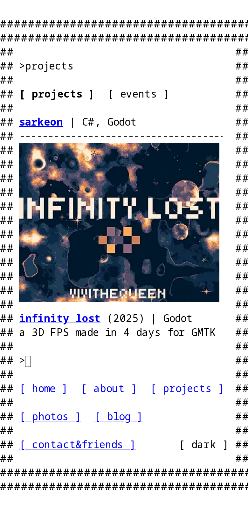

<!-- AI CODE -->
# violetquinn.dev

my personal site! built with [Astro](https://astro.build), everything drawn as a plain text terminal.



## where things are

```text
src/
├── pages/            one file per page. the file name is the url
│   ├── index.md          /
│   ├── about.astro       /about
│   ├── projects.astro    /projects (and /projects#events)
│   ├── photos.astro      /photos
│   ├── contact.md        /contact
│   └── blog/             /blog and /blog/<post>
├── layouts/
│   └── Frame.astro   the box of #s every page sits in
├── components/
│   ├── Nav.astro         the [ links ] at the bottom + dark mode button
│   ├── Prompt.astro      the > command prompt
│   ├── ScrollBox.astro   a 16-row box that scrolls a row at a time
│   └── Project.astro     one project/event, with its picture
├── data/
│   └── projects.ts   the list of projects and events
├── content/blog/     blog posts, one .md file each
├── scripts/          browser code shared between components
├── styles/
│   └── global.css    styles for every page
└── assets/images/
    ├── projects/     pictures for projects
    ├── events/       banners for events
    └── photos/       anything in here shows up on /photos
public/
└── 88x31/            friend buttons on /contact
```

## adding stuff

- **a project or event:** put its picture in `src/assets/images/projects` (or `events`), then add an entry in `src/data/projects.ts`
- **a blog post:** add `src/content/blog/my-post.md` with a `title` and `date` in the frontmatter. `draft: true` hides it from the real site
- **a photo:** drop it in `src/assets/images/photos`
- **a friend's 88x31:** put it in `public/88x31` and add a link in `src/pages/contact.md`

## commands

| command           | what it does                          |
| :---------------- | :------------------------------------ |
| `npm install`     | install dependencies                  |
| `npm run dev`     | run the site at `localhost:4321`      |
| `npm run build`   | build the real site into `./dist/`    |
| `npm run preview` | look at the built site before deploying |
